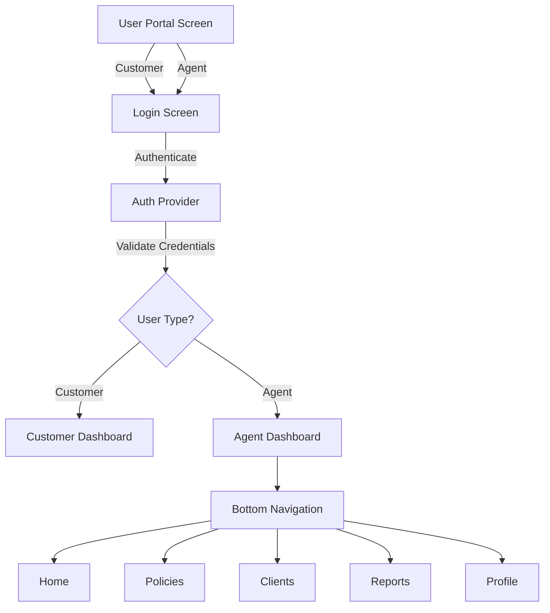
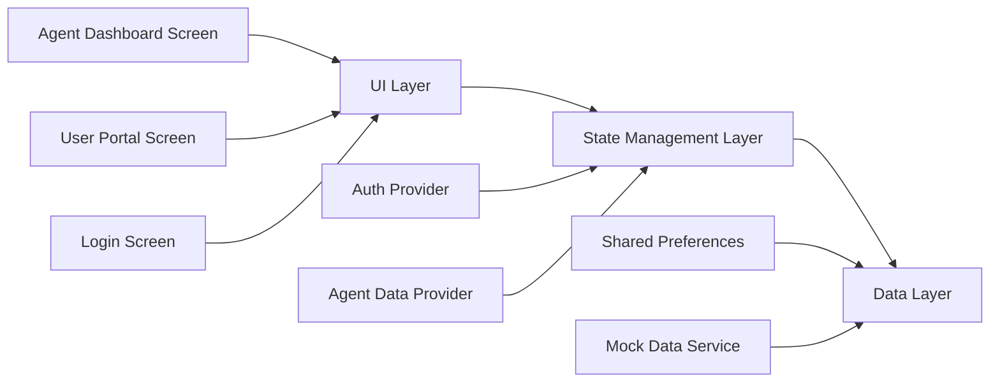
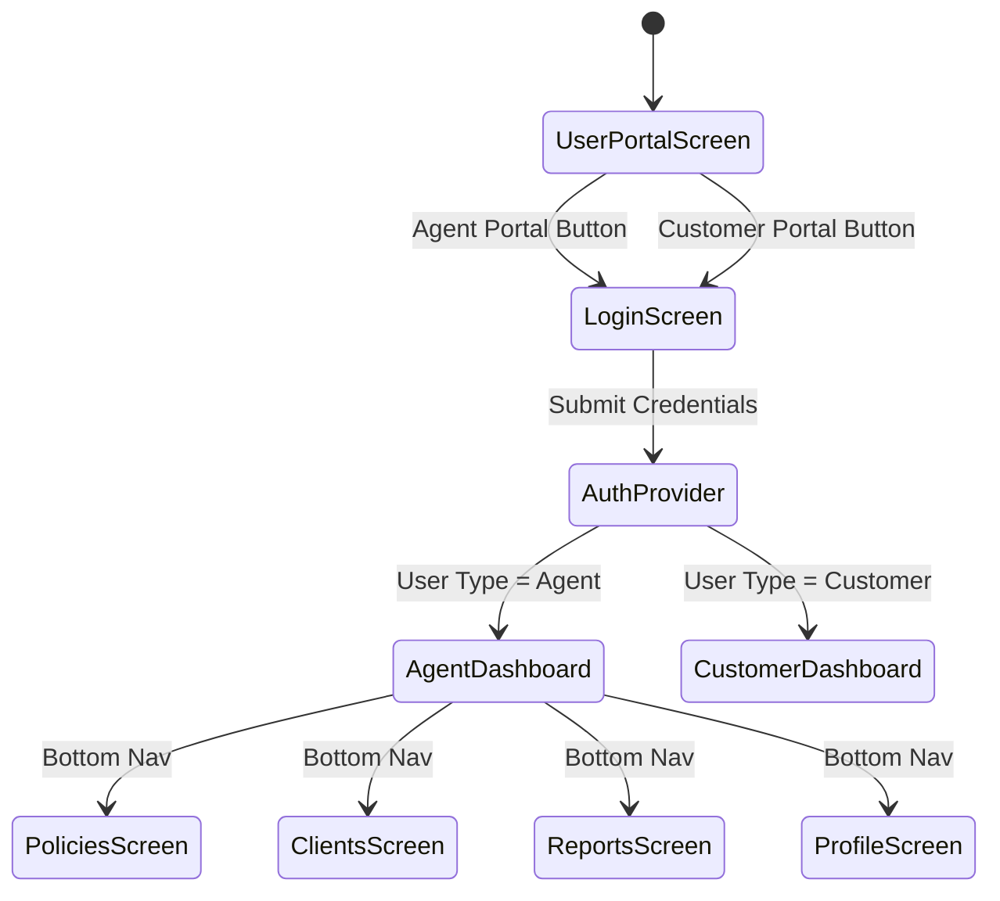

# Agent Dashboard Design Document

## Overview

The Agent Dashboard feature extends the Rex Insurance mobile application to support insurance agents alongside existing customer functionality. This feature introduces user type differentiation at the authentication level, enabling agents to access a dedicated portal with specialized tools for managing clients, tracking commissions, monitoring policies, and handling claims.

### Key Design Goals

- Extend existing authentication system to support user type differentiation (agent vs customer)
- Create a dedicated agent dashboard with real-time statistics and quick actions
- Implement role-based routing that directs users to appropriate dashboards
- Maintain session persistence with user type information
- Provide a bottom navigation system for agent-specific workflows
- Ensure visual consistency with existing customer portal design patterns

### Scope

This design covers:
- Authentication enhancements for user type detection
- Agent dashboard screen with statistics cards and quick actions
- Navigation routing logic based on user credentials
- Data models for agent-specific information
- Session management with user type persistence
- Bottom navigation for agent portal sections

Out of scope:
- Backend API implementation (mock data will be used)
- Detailed screens for Add Client, New Policy, File Claim, Reports, etc.
- Agent profile management features
- Commission calculation logic

## Architecture

### High-Level Architecture

The Agent Dashboard feature follows the existing Flutter application architecture using Provider for state management and named routes for navigation. The architecture extends the current authentication flow with user type detection and conditional routing.



### Component Architecture



### State Management Strategy

The feature uses Provider pattern consistent with the existing codebase:

- **AuthProvider**: Extended to handle user type (agent/customer) and role-based routing
- **AgentDataProvider**: New provider for managing agent-specific data (statistics, policies, clients)
- **Shared Preferences**: Used for session persistence including user type

### Navigation Flow



## Components and Interfaces

### 1. Enhanced Auth Provider

**File**: `lib/providers/auth_provider.dart`

**Responsibilities**:
- Authenticate users with email and password
- Determine user type from credentials (agent vs customer)
- Store user type in session data
- Provide user type information to routing logic
- Manage session persistence across app restarts

**Key Methods**:
```dart
Future<bool> login(String email, String password)
Future<void> checkAuthStatus()
Future<void> logout()
String? getUserType() // Returns 'agent' or 'customer'
bool isAgent()
bool isCustomer()
```

**State Properties**:
```dart
bool _isAuthenticated
String? _userId
String? _userName
String? _userEmail
String? _userType // New: 'agent' or 'customer'
```

### 2. Agent Data Provider

**File**: `lib/providers/agent_data_provider.dart` (New)

**Responsibilities**:
- Fetch and manage agent statistics (commission, clients, policies, claims)
- Provide policy list data
- Handle data refresh operations
- Manage loading and error states

**Key Methods**:
```dart
Future<void> fetchAgentStatistics()
Future<void> fetchPolicies()
Future<void> refreshData()
```

**State Properties**:
```dart
AgentStatistics? _statistics
List<Policy>? _policies
bool _isLoading
String? _errorMessage
```

### 3. User Portal Screen (Modified)

**File**: `lib/screens/user_portal_screen.dart`

**Modifications**:
- Update "Agent Portal Login" button to navigate to login screen with agent context
- Maintain visual distinction between customer and agent portal options

**Interface**:
- Agent Portal button click → Navigate to `/login` with agent flag

### 4. Login Screen (Modified)

**File**: `lib/screens/login_screen.dart`

**Modifications**:
- Accept optional user type context (agent or customer)
- After successful authentication, check user type from AuthProvider
- Route to appropriate dashboard based on user type

**Routing Logic**:
```dart
if (authProvider.isAgent()) {
  Navigator.pushReplacement(context, MaterialPageRoute(
    builder: (context) => const AgentDashboardScreen()
  ));
} else {
  Navigator.pushReplacement(context, MaterialPageRoute(
    builder: (context) => const CustomerDashboardScreen()
  ));
}
```

### 5. Agent Dashboard Screen

**File**: `lib/screens/agent_dashboard_screen.dart` (New)

**Responsibilities**:
- Display agent statistics (commission, clients, policies, claims)
- Provide quick action buttons
- Show policy list with status badges
- Implement bottom navigation
- Handle navigation to detail screens

**UI Structure**:
```
AppBar (with menu, logo, notifications)
└── ScrollView
    ├── Commission Card (Navy Blue)
    │   ├── Total Commission (₦ format)
    │   └── Percentage Change
    ├── Statistics Grid (3 cards)
    │   ├── Clients Card (Navy Blue)
    │   ├── Active Policies Card (Orange)
    │   └── Pending Claims Card (Green)
    ├── Quick Actions Row (3 buttons)
    │   ├── Add Client
    │   ├── New Policy
    │   └── File a Claim
    ├── My Policies Section
    │   ├── Section Header with "View All"
    │   └── Policy List (3-5 items)
    └── Bottom Navigation Bar
        ├── Home
        ├── Policies
        ├── Clients
        ├── Reports
        └── Profile
```

**Component Breakdown**:

- **Commission Card**: Large card displaying total commission with percentage change indicator
- **Statistics Cards**: Three cards showing client count, active policies, and pending claims with weekly changes
- **Quick Action Buttons**: Three prominent buttons for common agent tasks
- **Policy List**: Scrollable list of policies with type, number, renewal date, and status badge
- **Bottom Navigation**: Five-tab navigation bar with icons and labels

### 6. Route Guard Middleware

**Implementation**: In `main.dart` route configuration

**Responsibilities**:
- Check user authentication status
- Verify user type matches route requirements
- Redirect unauthorized access attempts

**Logic**:
```dart
// Pseudo-code for route guard
if (route.requiresAuth && !authProvider.isAuthenticated) {
  return LoginScreen();
}
if (route.requiresAgent && !authProvider.isAgent()) {
  return UnauthorizedScreen();
}
if (route.requiresCustomer && !authProvider.isCustomer()) {
  return UnauthorizedScreen();
}
```

## Data Models

### AgentStatistics Model

**File**: `lib/models/agent_statistics.dart` (New)

```dart
class AgentStatistics {
  final double totalCommission;
  final double commissionChangePercent;
  final int totalClients;
  final int newClientsThisWeek;
  final int activePolicies;
  final int newPoliciesThisWeek;
  final int pendingClaims;
  final int newClaimsThisWeek;
  
  AgentStatistics({
    required this.totalCommission,
    required this.commissionChangePercent,
    required this.totalClients,
    required this.newClientsThisWeek,
    required this.activePolicies,
    required this.newPoliciesThisWeek,
    required this.pendingClaims,
    required this.newClaimsThisWeek,
  });
  
  factory AgentStatistics.fromJson(Map<String, dynamic> json);
  Map<String, dynamic> toJson();
}
```

### Policy Model

**File**: `lib/models/policy.dart` (New or Enhanced)

```dart
class Policy {
  final String id;
  final String policyNumber;
  final String policyType;
  final String clientName;
  final DateTime renewalDate;
  final PolicyStatus status;
  final double premium;
  
  Policy({
    required this.id,
    required this.policyNumber,
    required this.policyType,
    required this.clientName,
    required this.renewalDate,
    required this.status,
    required this.premium,
  });
  
  factory Policy.fromJson(Map<String, dynamic> json);
  Map<String, dynamic> toJson();
}

enum PolicyStatus {
  active,
  pending,
  expired,
  cancelled
}
```

### User Model Enhancement

**File**: `lib/models/user.dart` (New or Enhanced)

```dart
class User {
  final String id;
  final String name;
  final String email;
  final UserType userType;
  final String? agentId; // Only for agents
  
  User({
    required this.id,
    required this.name,
    required this.email,
    required this.userType,
    this.agentId,
  });
  
  factory User.fromJson(Map<String, dynamic> json);
  Map<String, dynamic> toJson();
  
  bool isAgent() => userType == UserType.agent;
  bool isCustomer() => userType == UserType.customer;
}

enum UserType {
  agent,
  customer
}
```

## Screen Designs

### Agent Dashboard Screen Layout

**Visual Hierarchy**:

1. **App Bar** (Height: 56px)
   - Left: Menu icon
   - Center: Rex Insurance logo
   - Right: Notification bell icon

2. **Commission Card** (Full width, Navy Blue #1E2D64)
   - Total Commission: Large text (28px, bold, white)
   - Label: "Total Commission" (12px, white70)
   - Change Indicator: "+12.5%" (14px, green/red based on sign)

3. **Statistics Grid** (3 columns, equal width)
   - **Clients Card** (Navy Blue #1E2D64)
     - Count: 156 (24px, bold, white)
     - Label: "Total Clients" (12px, white70)
     - Weekly Change: "+8 this week" (10px, white60)
   
   - **Active Policies Card** (Orange #F47920)
     - Count: 320 (24px, bold, white)
     - Label: "Active Policies" (12px, white70)
     - Weekly Change: "+12 this week" (10px, white60)
   
   - **Pending Claims Card** (Green #4CAF50)
     - Count: 24 (24px, bold, white)
     - Label: "Pending Claims" (12px, white70)
     - Weekly Change: "+3 this week" (10px, white60)

4. **Quick Actions** (3 buttons, equal width)
   - Add Client (Icon: person_add, Navy Blue)
   - New Policy (Icon: description, Orange)
   - File a Claim (Icon: assignment, Green)

5. **My Policies Section**
   - Header: "My Policies" (16px, bold) with "View All" link
   - Policy Cards (List):
     - Icon (policy type specific)
     - Policy Type (13px, bold)
     - Policy Number (10px, gray)
     - Status Badge (Active/Pending/Expired)
     - Renewal Date (10px, orange)

6. **Bottom Navigation** (Height: 56px)
   - Home (Icon: home_outlined)
   - Policies (Icon: description_outlined)
   - Clients (Icon: people_outlined)
   - Reports (Icon: bar_chart_outlined)
   - Profile (Icon: person_outlined)

### Color Scheme

- **Primary Navy**: #1E2D64 (Commission card, Clients card, primary buttons)
- **Accent Orange**: #F47920 (Active Policies card, action buttons, highlights)
- **Success Green**: #4CAF50 (Pending Claims card, positive indicators)
- **Background**: #FFFFFF (White)
- **Card Background**: #FAFAFA (Light gray)
- **Text Primary**: #000000 (Black)
- **Text Secondary**: #666666 (Gray)
- **Border**: #E0E0E0 (Light gray)

### Typography

Following existing app theme (Poppins font family):
- **Large Numbers**: 28px, Bold
- **Card Titles**: 16px, Bold
- **Statistics**: 24px, Bold
- **Body Text**: 14px, Regular
- **Labels**: 12px, Regular
- **Small Text**: 10px, Regular

### Spacing

- **Screen Padding**: 16px
- **Card Padding**: 20px
- **Card Margin**: 12px vertical
- **Element Spacing**: 8px, 12px, 16px, 24px (multiples of 4)

## Error Handling

### Authentication Errors

**Scenario**: Invalid credentials
- **Handling**: Display SnackBar with error message "Invalid email or password"
- **User Action**: Allow retry with corrected credentials

**Scenario**: Network timeout
- **Handling**: Display SnackBar with "Connection timeout. Please try again."
- **User Action**: Retry button in error message

### Data Loading Errors

**Scenario**: Failed to fetch agent statistics
- **Handling**: Display error state in dashboard with retry button
- **Fallback**: Show cached data if available with "Data may be outdated" indicator

**Scenario**: Empty data state
- **Handling**: Display empty state message "No data available yet"
- **User Action**: Provide "Refresh" button

### Navigation Errors

**Scenario**: Unauthorized access attempt (customer trying to access agent routes)
- **Handling**: Redirect to appropriate dashboard with toast message
- **Logging**: Log unauthorized access attempts for security monitoring

**Scenario**: Session expired
- **Handling**: Redirect to login screen with message "Session expired. Please log in again."
- **User Action**: Re-authenticate

### Form Validation Errors

**Scenario**: Invalid input in quick action forms
- **Handling**: Inline validation with red error text below field
- **Prevention**: Disable submit button until all fields are valid

## Testing Strategy

### Unit Testing

Unit tests will verify specific examples, edge cases, and error conditions for individual components and functions.

**Auth Provider Tests**:
- Test login with valid agent credentials returns success
- Test login with valid customer credentials returns success
- Test login with invalid credentials returns failure
- Test user type is correctly stored in session
- Test session restoration on app restart
- Test logout clears all session data

**Agent Data Provider Tests**:
- Test fetchAgentStatistics with mock data returns correct model
- Test error handling when API call fails
- Test loading state transitions
- Test data refresh updates existing data

**Data Model Tests**:
- Test AgentStatistics.fromJson with valid JSON
- Test AgentStatistics.toJson produces correct format
- Test Policy model serialization/deserialization
- Test User model isAgent() and isCustomer() methods

**Routing Logic Tests**:
- Test agent credentials route to agent dashboard
- Test customer credentials route to customer dashboard
- Test unauthorized access is blocked
- Test session-based routing on app restart

### Property-Based Testing

Property tests will verify universal properties across all inputs using a property-based testing library (e.g., `dart_check` or custom generators with 100+ iterations).

**Configuration**: Each property test will run minimum 100 iterations with randomized inputs.

**Test Tagging**: Each property test will include a comment:
```dart
// Feature: agent-dashboard, Property {number}: {property_text}
```

### Integration Testing

**User Flow Tests**:
- Test complete agent login flow from user portal to dashboard
- Test navigation between dashboard tabs
- Test quick action button navigation
- Test policy list item navigation
- Test logout flow

**State Management Tests**:
- Test Provider state updates trigger UI rebuilds
- Test multiple providers work together correctly
- Test state persistence across navigation

### Widget Testing

**Agent Dashboard Screen Tests**:
- Test all statistics cards render correctly
- Test quick action buttons are present and tappable
- Test policy list displays correct number of items
- Test bottom navigation renders all tabs
- Test loading state displays progress indicator
- Test error state displays error message

**Login Screen Tests**:
- Test form validation works correctly
- Test submit button is disabled during loading
- Test error messages display for invalid credentials
- Test successful login navigates to correct dashboard

### Mock Data Strategy

For development and testing, mock data services will provide:
- Sample agent statistics with realistic values
- Sample policy lists with various statuses
- Simulated API delays (500ms-1000ms)
- Configurable error scenarios for testing error handling

**Mock Data Service** (`lib/services/mock_agent_service.dart`):
```dart
class MockAgentService {
  Future<AgentStatistics> getAgentStatistics() async {
    await Future.delayed(Duration(milliseconds: 500));
    return AgentStatistics(/* mock data */);
  }
  
  Future<List<Policy>> getPolicies() async {
    await Future.delayed(Duration(milliseconds: 500));
    return [/* mock policies */];
  }
}
```

### Test Coverage Goals

- Unit test coverage: >80% for business logic
- Widget test coverage: >70% for UI components
- Integration test coverage: All critical user flows
- Property test coverage: All correctness properties from requirements


## Correctness Properties

A property is a characteristic or behavior that should hold true across all valid executions of a system—essentially, a formal statement about what the system should do. Properties serve as the bridge between human-readable specifications and machine-verifiable correctness guarantees.

### Property Reflection

After analyzing all acceptance criteria, I identified several redundant properties that can be consolidated:

- Properties 2.2, 2.3, 11.2, and 11.3 all test routing based on user type - these can be combined into a single comprehensive routing property
- Properties 4.4, 5.4, and 6.4 all test the same formatting rule for positive weekly changes - these should be combined
- Properties 3.1, 4.1, 4.2, 5.1, 5.2, 6.1, and 6.2 all test that statistics are displayed - these can be combined into a single property about complete statistics display
- Properties 8.2 and 8.3 both test policy list item display - these can be combined

The following properties represent the unique, non-redundant validation requirements:

### Property 1: Agent Authentication Type Detection

For any valid agent credentials, when authenticated through the Auth_Provider, the user type should be set to "agent" and stored in session data.

**Validates: Requirements 2.1, 2.5, 11.1**

### Property 2: User Type Based Routing

For any authenticated user, the Navigation_Router should route to Agent_Dashboard if user type is "agent" and to Customer_Dashboard if user type is "customer".

**Validates: Requirements 2.2, 2.3, 11.2, 11.3**

### Property 3: Invalid Credentials Error Handling

For any invalid credentials (empty, malformed, or incorrect), the Login_Screen should display an error message and prevent authentication.

**Validates: Requirements 2.4**

### Property 4: Commission Amount Formatting

For any commission amount, the Agent_Dashboard should format it with Nigerian Naira symbol (₦), thousand separators, and exactly two decimal places.

**Validates: Requirements 3.1, 3.3**

### Property 5: Percentage Change Indicator

For any percentage change value, the Agent_Dashboard should display positive values with a positive indicator (+ sign or green color) and negative values with a negative indicator (- sign or red color).

**Validates: Requirements 3.4**

### Property 6: Complete Statistics Display

For any agent statistics object, the Agent_Dashboard should display all required fields: total commission, commission change percentage, total clients, new clients this week, active policies, new policies this week, pending claims, and new claims this week.

**Validates: Requirements 3.1, 3.2, 4.1, 4.2, 5.1, 5.2, 6.1, 6.2**

### Property 7: Positive Weekly Change Formatting

For any positive weekly change value (clients, policies, or claims), the Agent_Dashboard should format it with a plus sign prefix (e.g., "+8").

**Validates: Requirements 4.4, 5.4, 6.4**

### Property 8: Policy List Item Completeness

For any policy in the policy list, the Agent_Dashboard should display policy type, policy number, renewal date, and a status badge.

**Validates: Requirements 8.2, 8.3**

### Property 9: Policy Item Navigation

For any policy item clicked in the policy list, the Navigation_Router should navigate to the policy details screen with the correct policy identifier passed as a parameter.

**Validates: Requirements 8.5**

### Property 10: Bottom Navigation Tab Routing

For any bottom navigation tab clicked (Home, Policies, Clients, Reports, Profile), the Navigation_Router should navigate to the corresponding screen.

**Validates: Requirements 9.7**

### Property 11: Active Tab Highlighting

For any bottom navigation state, exactly one tab should be highlighted as active, and it should correspond to the current screen.

**Validates: Requirements 9.8**

### Property 12: Session Persistence Round Trip

For any successful agent login, storing the session data and then restoring it (simulating app restart) should produce an equivalent authenticated state with the same user type, user ID, and user email.

**Validates: Requirements 10.1, 10.2, 10.4**

### Property 13: Logout Session Clearing

For any authenticated session (agent or customer), after logout, all session data should be cleared and the user should be in an unauthenticated state.

**Validates: Requirements 10.3**

### Property 14: Role-Based Access Control

For any authenticated agent user, attempts to access customer-only screens should be blocked, and for any authenticated customer user, attempts to access agent-only screens should be blocked.

**Validates: Requirements 11.4, 11.5**

